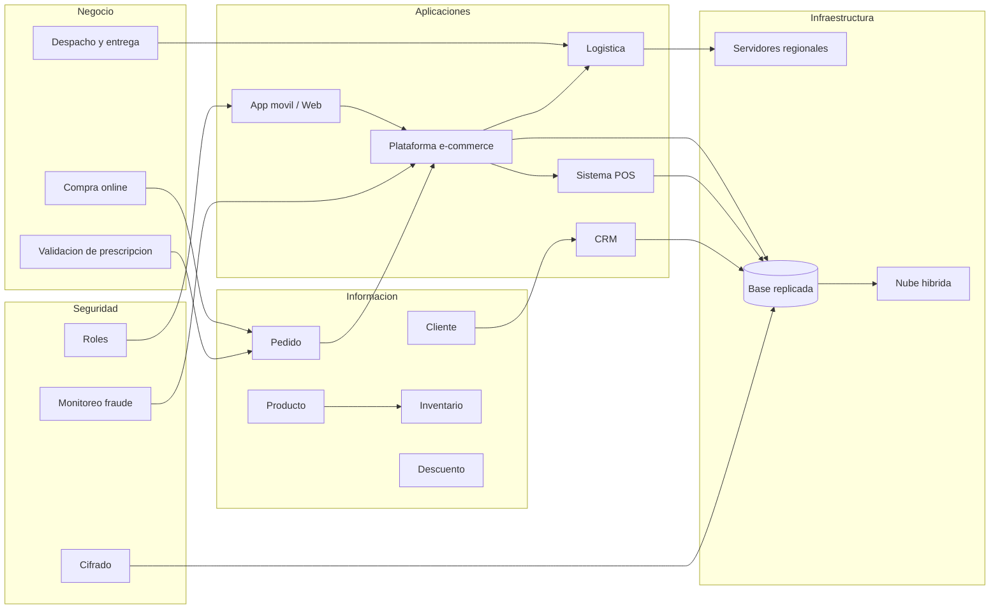

# Registro de Trabajo en Clase - Taller 7

## Fecha de la sesion

Mayo de 2026

## Integrantes presentes

- Carlos David Cruz Pavas
- Juan Felipe Cepeda Uribe
- Esteban Fernando Forero Montejo

## Caso base trabajado

El caso base fue **FarmApp**, una cadena de farmacias con canales fisicos y e-commerce. El objetivo fue integrar vistas de negocio, informacion, aplicaciones, infraestructura y seguridad en una sola narrativa arquitectonica.

## Actividades realizadas en clase

- Se identificaron las capas principales del caso FarmApp.
- Se relaciono el proceso de compra online con aplicaciones internas como POS, CRM, inventario y logistica.
- Se discutio como los datos de Producto, Cliente, Pedido, Descuento e Inventario conectan los procesos de negocio con las aplicaciones.
- Se ubicaron componentes de infraestructura como nube hibrida, servidores regionales y base de datos replicada.
- Se agregaron controles de seguridad: roles, cifrado, monitoreo de fraude y control de acceso a datos personales.

## Vista integrada preliminar

## Decisiones de modelado

| Decision | Justificacion |
|----------|---------------|
| Separar vistas por capa | Facilita ver como negocio, datos, aplicaciones, infraestructura y seguridad se soportan entre si |
| Conectar negocio con datos | Permite explicar por que entidades como Pedido e Inventario son criticas |
| Mostrar aplicaciones operativas | POS, CRM y logistica explican la continuidad entre canal digital y tiendas fisicas |
| Incluir seguridad transversal | FarmApp maneja clientes, pagos y medicamentos, por lo que seguridad no puede quedar aislada |

## Tareas definidas

| Tarea asignada | Responsable | Resultado |
|----------------|-------------|-----------|
| Adaptar la estructura de vistas al cliente real | Todo el equipo | Usar CNA, banco de preguntas, app, Turso/OneDrive y proveedor |
| Redactar informe narrativo | Todo el equipo | `talleres-empresa/taller-7/informe.md` |
| Consolidar diagrama del cliente | Todo el equipo | `talleres-empresa/taller-7/tablero-integrado-cliente.mmd` |
| Revisar referencias de documentacion arquitectonica | Todo el equipo | `talleres-empresa/taller-7/referencias.md` |

## Conclusiones de clase

El ejercicio mostro que una arquitectura integrada no debe presentar diagramas aislados. La vista de negocio explica el objetivo, la informacion estructura lo que se gestiona, las aplicaciones ejecutan el flujo, la infraestructura lo soporta y la seguridad gobierna los riesgos transversales.
